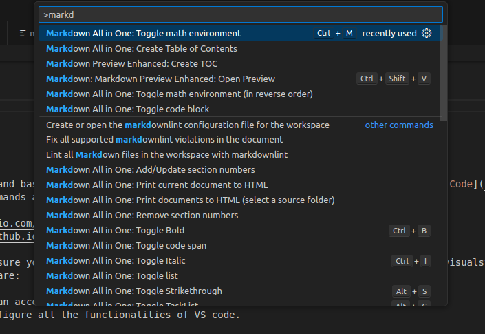
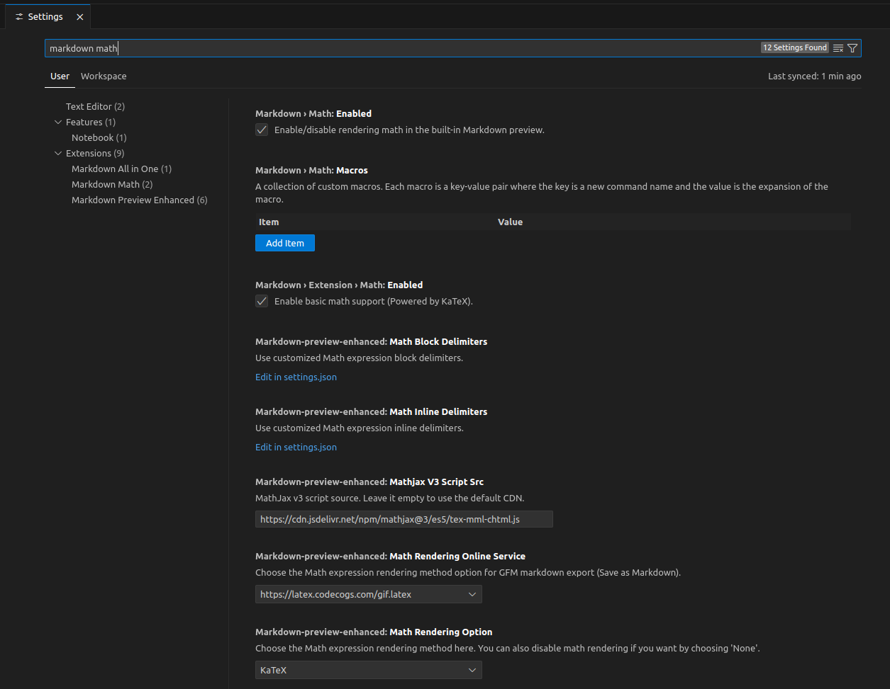
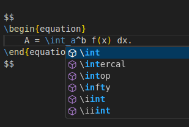

<!-- omit from toc -->
# VS Code and Markdown

In this document I will describe setting, useful snippets and basic typesetting rules that I use to write markdown documents within [VS Code](https://code.visualstudio.com/).
Most importantly, I will go through the most important commands and cheats of two *mandatory* markdown extensions for VS Code:

- the [markdown all in one](https://marketplace.visualstudio.com/items?itemName=yzhang.markdown-all-in-one) extension;
- and the [markdown preview enhanced](https://shd101wyy.github.io/markdown-preview-enhanced/#/) extension.

However, before delving into the syntax of markdown, make sure you are confortable with VS Code and its [functionalities](https://code.visualstudio.com/docs).
In particular, the *must-know commands* to master VS Code are:

- the command palette, `ctrl`+`shift`+`P`, from which we can access and execute any command;
- and the settings page, `ctrl`+`,`, from which we can configure all the functionalities of VS code.

Using the command palette is straightforward. After opening it, simply start typing any command you might want to execute. Commands are *grouped* based on which *extension* they belong to.
For example, typing `markdown` will display any command that contains markdown in any installed extensions (see the next figure).

{width=60%}

Settings work in a similar way. They are collected together in a **big container** that can be searched via the **search bar**. This is especially useful when we are looking to some configuration that we don't quite remember. For example, we don't remember if this setting belong to this or that extension, or to this or that language. Simply type a keyword, all instances of that keyword will appear and the drop down menu on the left will help refine the search. For example, by typing `markdown math` in the setting search bar, VS Code will show all the available configurations (see next figure).



That being said, markdown is supposed to be *easy* to type and format and for this reason I use it mostly for *fast note-taking purposes*.
Also, any valid HTML entry is also valid markdown. Which means that HTML can be used to further beautify any markdown document.
And finally, markdown documents are easily *portable*. Exporting from `HTML` to `pdf` can be done by any browser.
For those cases where I need a more sophisticated typographical and aestethic tool, I simply use Latex.

<!-- pagebreak -->

<!-- omit from toc -->
## Table of contents

- [1. Basic markdown syntax](#1-basic-markdown-syntax)
  - [1.1. Headers](#11-headers)
  - [1.2. Emphasis](#12-emphasis)
  - [1.3. Lists](#13-lists)
  - [1.4. Links and images](#14-links-and-images)
  - [1.5. Code and code blocks](#15-code-and-code-blocks)
  - [1.6. Task lists](#16-task-lists)
  - [1.7. Quotes](#17-quotes)
  - [1.8. Tables](#18-tables)
- [2. Extended markdown syntax](#2-extended-markdown-syntax)
  - [2.1. Section numbering and table of contents](#21-section-numbering-and-table-of-contents)
  - [2.2. Admonitions](#22-admonitions)
  - [2.3. Subscripts, superscripts and markings](#23-subscripts-superscripts-and-markings)
  - [2.4. Abbrevitations](#24-abbrevitations)
  - [2.5. Citations](#25-citations)
  - [2.6. Improved tables](#26-improved-tables)
  - [2.7. Front-matter](#27-front-matter)
- [3. Math typesetting](#3-math-typesetting)
  - [3.1. Simple math environment](#31-simple-math-environment)
  - [3.2. Numbering equations](#32-numbering-equations)
  - [3.3. Labelling equations](#33-labelling-equations)
  - [3.4. Math autocompletion](#34-math-autocompletion)
- [4. Custom snippets](#4-custom-snippets)
  - [4.1. Latex snippets](#41-latex-snippets)
  - [4.2. Page formatting snippets](#42-page-formatting-snippets)
- [5. Custom settings](#5-custom-settings)
  - [5.1. Export to pdf](#51-export-to-pdf)
  - [5.2. Chrome path](#52-chrome-path)
- [6. Shortcut keybindings](#6-shortcut-keybindings)
  - [6.1. Default shortcuts](#61-default-shortcuts)

<!-- pagebreak -->

## 1. Basic markdown syntax

### 1.1. Headers

Headers are specified using the `#` (hash) chatracter.

```md
# Header 1
## Header 2
...
###### Header 6
```

Tags to headers can be given in curly brackets.

```md
## Header with id {#mytag}
```

Every header already comes with a predefined tag. For example, this section of the document (*i.e.* Basic markdown syntax) has tag
`#basic-markdown-syntax`, and we can create a link with the following command

```md
[click here to jump to the section](#basic-markdown-syntax)
```

The above produces this [click here to jump to the section](#1-basic-markdown-syntax).

### 1.2. Emphasis

Emphasis such as *italic*, **bold** and ~~strikethrough~~ is done with

```md
*italic* 
**bold**
~~strikethrough~~
```

### 1.3. Lists

Use the `-` (hyphen) for unordered lists

```md
- item
- another item
    - another sub item
```

The above produces:
- item
- another item
    - another sub item

Use **any** number for ordered lists

```md
1. first
1. second
42.  third
```

The above produces:

1. first
1. second
42.  third

Note that numbers are correctly rendered despite the above typo.

### 1.4. Links and images

Links and images can be inlcuded with sligtly similar syntax

```md
[some text](/path/to/link)

```

### 1.5. Code and code blocks

Code and blocks of code are rendered using ` (backticks). Use a single backtick for inline code

```md
`inline code`
```

Use triple ``` backticks or blocks of code

````
```python {.line-numbers}
import numpy as np
a = np.zeros(10)
print("Hello world!")
print(a)
```
````

which produces

```python {.line-numbers}
import numpy as np
a = np.zeros(10)
print("Hello world!")
print(a)
```

### 1.6. Task lists

Task lists can be done with `- [x]`

```md
- [x] complete item
- [ ] incomplete item
```

which results in

- [x] complete item
- [ ] incomplete item

### 1.7. Quotes

Quotes are achieved with `>`

```md
> One day Sir, you may tax it!
```

As Michael Faraday once said, when a politician asked about the utility of electricity:

> One day Sir, you may tax it!

### 1.8. Tables

Basic tables are constructed using any number of `-` (hyphens) for horizontal spacing, and vertical bars `|` for columns separation.
For example, the following markdown snippet

```md
| title1          | title2 | longer title3 |
| :-------------- | :----: | ------------: |
| cicciopasticcio |   42   |          ciao |
| some            |  info  |         pollo |
```

will produce

| title1          | title2 | longer title3 |
| :-------------- | :----: | ------------: |
| cicciopasticcio |   42   |          ciao |
| some            |  info  |         pollo |

Note: the justification of the text is given by the way we encapsulate colons and dashes:

- `:---` left
- `:---:` center
- `---:` right

## 2. Extended markdown syntax

### 2.1. Section numbering and table of contents

Both [markdown all in one](https://marketplace.visualstudio.com/items?itemName=yzhang.markdown-all-in-one) and
[markdown preview enhanced](https://shd101wyy.github.io/markdown-preview-enhanced/#/) provide commands to automate the creation of a *table of contents*.
I personally prefer *markdown all in one* because it also provides the automatic *enumeration of the sections*.

To enumerate all the sections in the document simply do:

1. toggle the command palette `ctrl`+`shift`+`P`;
2. start typing `section number` and select `Markdown All in One: Add/Update section numbers`;
3. (optional) to omit a section from the counting, type `<!-- omit from toc -->` just before the correspondent header.

To reset the counting, select `Markdown All in One: Remove section numbers` from the command palette.
Also, if we edit the document and add/remove sections, we need to update the numbering manually by re-running `Markdown All in One: Add/Update section numbers`.

On the other hand, to create the TOC do the following:

1. position the cursor where you want the TOC;
2. toggle the command palette `ctrl`+`shift`+`P`;
3. start typing `create toc` and select `Markdown All in One: Create Table of Contents`;

By default, any time we save the document the TOC is automatically updated.

### 2.2. Admonitions

Admonitions are rendered with triple exclamation marks `!!!` in this way

```md
!!! note This is the admonition title
    This is the admonition body
```

The above produces

!!! note This is the admonition title
    This is the admonition body

### 2.3. Subscripts, superscripts and markings

Subscripts, superscipts and markings are obtained using `~`, `^` and `==` in the following way

```md
The ==Avogadro=='s number is N~A~=6.02214076 × 10^23^.
```

The above code produces the following sentence:  
The ==Avogadro=='s number is N~A~=6.02214076 × 10^23^.

### 2.4. Abbrevitations

Markdown Preview Enhanced (MPE), can render the spelling any abbreviation if we hoover the mouse over it.
To do it, we simply need to define the abbreviation

```md
*[MPE]: Markdown Preview Enhanced
```

Write the above snippet anywhere in the code. The abbreviation hoovering feature will be available over the whole document.  
*Note: mouse hoovering works best in the native markdown preview and when exporting to HTML. In a pdf version, this might not be rendered correctly.*
*[MPE]: Markdown Preview Enhanced

### 2.5. Citations

Citations (or footnotes) are appended at the end of the document. To define them type for example

```md
[^einstein-17-1905]: A. Einstein, Annalen der Physik, 17, 1905, Über einen die Erzeugung und Verwandlung des Lichtes betreffenden heuristischen Gesichtspunkt.
```

Then to address it [^einstein-17-1905] type the label `[^einstein-17-1905]`.

[^einstein-17-1905]: A. Einstein, Annalen der Physik, 17, 1905, Über einen die Erzeugung und Verwandlung des Lichtes betreffenden heuristischen Gesichtspunkt.

### 2.6. Improved tables

The setting `markdown-preview-enhanced.enableExtendedTableSyntax` allows to join empty columns and rows in a table.
The characters `>` (angle bracket) or ` ` (empty space) pad a row. The character `^` pads a column.

```md
| title1 |     title2      | longer title3 |
| :----- | :-------------: | ------------: |
| ciccio |       42        |          ciao |
| ^      | cicciopasticcio |               |
```

The above code results in the following

| title1 |     title2      | longer title3 |
| :----- | :-------------: | ------------: |
| ciccio |       42        |          ciao |
| ^      | cicciopasticcio |               |

### 2.7. Front-matter

At the very start of a markdown document we can include the *front-matter*.
This is some code enclosed between triple dashes `---` that contains metadata and/or formatting instructions.
For example, this very same document has the following front-matter:

```md
---
#title: "Markdown preview enhanced notes"
author: "Stefano Dal Forno"
date: June 5, 2025

puppeteer:
    #path: "some/path/to/file.pdf"
    landscape: false
    format: "A4"
    #timeout: 100
    margin:
        top: 3cm
        right: 2cm
        bottom: 2cm
        left: 2cm

export_on_save:
    #html: true
    puppeteer: true
---
```

The first three entries, `title`, `author` and `date`, are just some metadata to include in the exported HTML or PDF files.
The `puppeteer` entry defines the PDF layout options to be used by [puppeteer](https://pptr.dev/).
The last entry toggles the `export_on_save` feature: anytime we save the `.md` document, a `.pdf` will be also created.

## 3. Math typesetting

### 3.1. Simple math environment

To type equaitons, we **must** embed them in dollar signs `$`:

- inline style `$x=4$` produces the following $x=4$;
- double dollar style `$$\sum\frac{1}{n}.$$` produces the below result $$\sum\frac{1}{n}.$$

Note that both the above equations are *not numbered*.

### 3.2. Numbering equations

To include a number tag, we must use latex environments. For example, with the following code

```md
$$
\begin{equation}
    A = \int_a^b f(x) dx.
\end{equation}
$$
```

we obtain

$$
\begin{equation}
    A = \int_a^b f(x) dx.
\end{equation}
$$

```math
\begin{equation}
A = \int_a^b f(x) dx.
\end{equation}
```

### 3.3. Labelling equations

The default Latex renderer is `Katex`, which is fast, but *does not include* many features. For example, labelling equations is not possible with Katex.
A work around is done using HTML `anchor` and `id` in the following way

```md
<a id="eq:schrodinger"></a>
$$
\begin{equation}
    -i \hbar\frac{\partial\Psi}{\partial t} = \hat H \Psi.
\end{equation}
$$
```

which produces the following **labelled** equation

<a id="eq:schrodinger"></a>
$$
\begin{equation}
    -i \hbar\frac{\partial\Psi}{\partial t} = \hat H \Psi.
\end{equation}
$$

The above [Eq. 2](#eq:schrodinger) has been labelled using the usual link syntax `[Eq. 2](#eq:schrodinger)`.

### 3.4. Math autocompletion

Markdown all in one provides most autocompletion Latex snippets for the math environment.
Typing `\` backslash within dollar signs will trigger snippet suggestions for all latex math keywords (for example, see the next figure).



## 4. Custom snippets

VS Code can be personalised by adding code snippets that automatically triggers depending on keyword and environments.
To do that, go to `preferences` -> `configure snippets` and select the markdown language.
A `markdown.json` file will open up where we can add our custom markdown snippets.

However, snippets suggestions are often not enable by default. To do this, go to `file`->`preferences`->`settings` and type `@lang:markdown`.
Then select:

- editor.wordBasedSuggestions: off.
- editor.quickSuggestions: other: on.

This way I don't get *plain text* suggestion but I do get *code snippet* suggestion while typing. Nice!

### 4.1. Latex snippets

```json
"latex equation": {
    "prefix": "equation",
    "body": [
        "$$\n\\begin{equation}\n\t${1:x = y}\n\\end{equation}\n$$",
    ],
    "description": "Latex equation environment within dollar signs"
},

"latex equation with label": {
    "prefix": "equation-label",
    "body": [
        "<a id=\"eq:${1:label}\"></a>\n$$\n\\begin{equation}\n\t${2:x = y}\n\\end{equation}\n$$",
    ],
    "description": "Latex equation environment with label"
},
```

### 4.2. Page formatting snippets

```json
"page break": {
    "prefix": "pagebreak",
    "body": [
        "<!-- pagebreak -->"
    ],
    "description": "Insert a page break"
},
	
"omit from toc": {
    "prefix": "omit-toc",
    "body": [
        "<!-- omit from toc -->"
    ],
    "description": "Omit the following header from table of contents"
},
```

## 5. Custom settings

In this section I simply list some setting configuarations that I find useful/mandatory.

### 5.1. Export to pdf

To convert `.md` files to `.pdf`, I follow either of the following two methods:

1. right click *inside the document* and select convert to `html`; then open your browser of choice and select export to `pdf`, or
2. right click *inside the preview* and select `export`->`chrome-puppeteer`->`pdf`.

The second method requires:
- installation of `chrome` ([here](https://www.google.com/chrome/))
- set `chrome path` (see next [section](#52-chrome-path))

Many people on the internet suggest to use tools such as `nbconverter`, `pandoc`, `markdown-pdf` extension, and the like.
Honestly, I tried all of them and there are always problems when rendering the math.
The two approaches descibed above are the ones that produce good math formulas and do not require too much tinkering with libraries and stuff.

Also, remember that the [*front-matter*](#27-front-matter) code block has the option to export on save.
This produces the following [file](./markdown-advanced.pdf).

### 5.2. Chrome path

It can happen that VS Code is unable to find the path to chrome or puppeteer to perform the pdf export.
If this is the case, simply open the setting with `ctrl`+`,` and type `markdown-preview-enhanced.chromePath`.
Set the empty field to whatever is your chrome path, mine is `/usr/bin/google-chrome`.

## 6. Shortcut keybindings

This is just a list of keybinding shortcuts specific for VS Code and markdown.
For a full description please refer to the official pages
[all-in-one](https://github.com/yzhang-gh/vscode-markdown?tab=readme-ov-file#keyboard-shortcuts-1),
[mpe](https://github.com/shd101wyy/vscode-markdown-preview-enhanced?tab=readme-ov-file#keybindings) and
[vscode](https://code.visualstudio.com/docs/configure/keybindings).

### 6.1. Default shortcuts

| key                    | command                               |
| :--------------------- | :------------------------------------ |
| `ctrl`+`B`             | Toggle bold text                      |
| `ctrl`+`I`             | Toggle italic text                    |
| `alt`+`S`              | Toggle strikethrough text             |
| `ctrl`+`M`             | Toggle/cycle through math environment |
| `ctrl` + `shift` + `]` | Toggle header level up                |
| `ctrl` + `shift` + `[` | Toggle header level down              |
| `ctrl`+`shift`+`I`     | Format/beautify document              |

