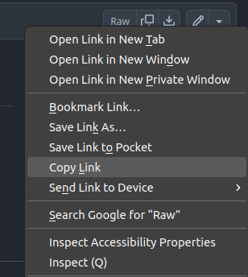

# A clickable link that directly starts the download

We have a file in a repository that we want to share. For example, the link to this very same file is:

https://github.com/t3n0/notes/blob/main/other/download-link.md

  

By clicking the above link, we will just move to this specific github page.

To generate a link that starts the **download** immediately we need to do the following:
1. navigate to the desired github file;
2. right click on the `raw` button on the top right \
   
4. select `copy link` \
   
6. paste the link anywhere you like, for example [here](https://github.com/t3n0/notes/raw/main/other/download-link.md).
https://github.com/t3n0/notes/raw/main/other/download-link.md
